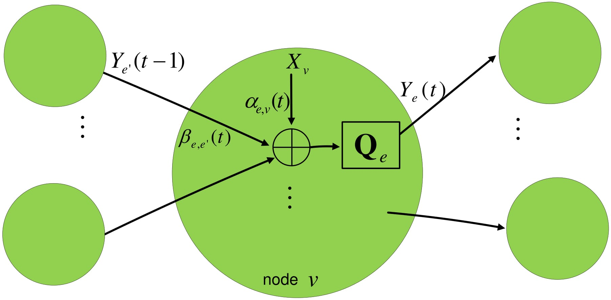

# Quantized Network Coding for Wireless Sensor Networks
This repository includes the MATLAB codes related to my PhD thesis on the topic of Quantized Network Coding for Wireless Sensor Network in conjunction with IEEE 802.15.4 standard.

## Thesis PDF
You can download the full final version of my thesis [here](https://github.com/mnabaee/networkcoding/blob/master/thesis/thesis_.pdf).

## Papers
Some of the findings of the thesis are published in the following articles:
* [Quantized Network Coding for Sparse Messages](https://arxiv.org/pdf/1201.6271.pdf)
* [Restricted Isometry Property in Quantized Network Coding of Sparse Messages](https://arxiv.org/pdf/1203.1892v2.pdf)
* [Non-Adaptive Distributed Compression in Networks](https://arxiv.org/pdf/1301.5973.pdf)
* [Bayesian Quantized Network Coding via Generalized Approximate Message Passing](http://ieeexplore.ieee.org/document/6834995/)
* [Quantized Network Coding for Correlated Sources](http://link.springer.com/article/10.1186/1687-1499-2014-40/fulltext.html)

## MATLAB Simulations
The files for all of the numerical simulations (mostly in MATLAB) can be found [here](https://github.com/mnabaee/networkcoding/tree/master/matlab).
